<h1 align="center">How To Pasta</h1>

[view my project here.](https://themanintheback.github.io/project1/index.html)

The How To Pasta website is a website for adults to sign up for cooking classes on how  to make fresh pasta.

<h2>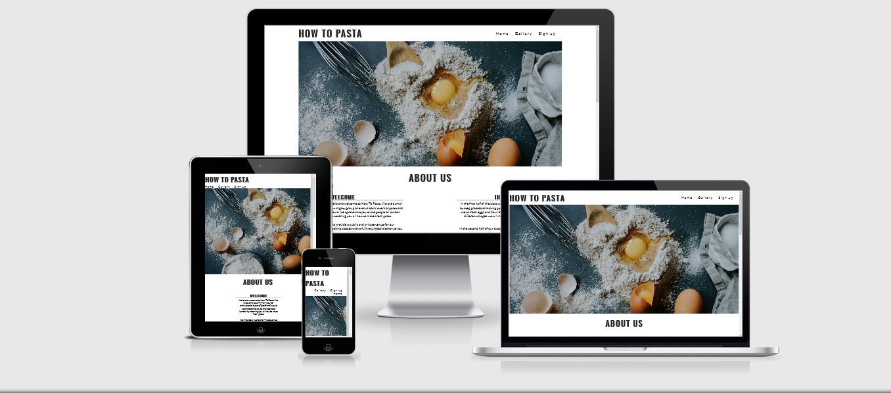<h2>

# User Experience (UX)

- ## User Stories

    - #### First Time Vistitor Goals

        1. As a First Time Vistor, I want to understand the purpose of the website and what the company is providing.

        2. As a First Time Visitor, I want to easily navigate through the website to find what I'm looking for. 

- ## Design
    - ### Colour Scheme

        - The main colors used on the website are black and white.

    - ### Typography

        - The Lato font is the main font used throughout the website with the oswald font used for the h1 and h2 headings. The Sans-Serif font is used as the fallback just in case for some reason they are not being imported from  Google fonts.

    - ### Imagery

        - Imagery is used throughout the website to catch the user's attention.

# Features

- ## Navigation
    
    - placed at the top left of the page you have the website name: How To Pasta that links to top of the home page.

    - The other links are placed at the top right of the page: Home, Gallery and Sign up.

    - The Home link just like the website name takes the user back to top of the home page.

    - The Gallery link takes then user to the sites gallery page with images taken from the class.

    - The Sign Up link takes the user to the sites from page where the user can sign up for the classes by entering there first name, last name, email address. And finaly day and time of when you want to take the class.

<h2>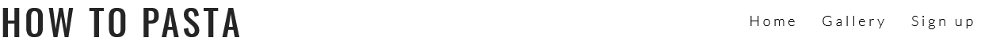</h2>

- ## Header

    - The Header shows the name of the site at the top left of page.
    
    - The navigation links are at the top right of the page so the user can move from one page to the other.

    - The also shows the hero image for the site used to catch the users attention.

<h2>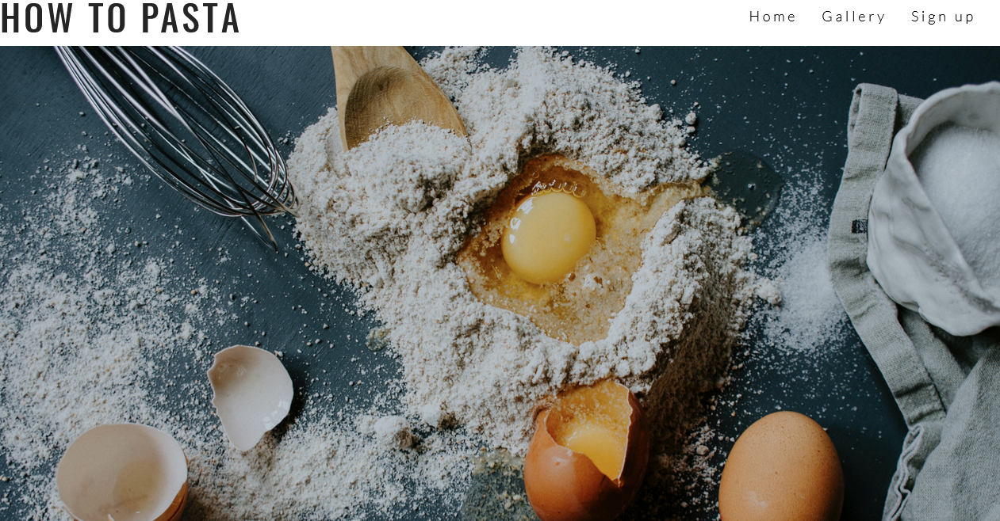</h2>

- ## The About Us Section

    - At the top of the section you have the heading: About Us.

    - On the left you have the WELCOME area where the company gives a introduction and explains what they are providing to the user.

    - On the right you have the IN THE CLASS area which goes into detail about what you will be doing 
    in the class.

<h2>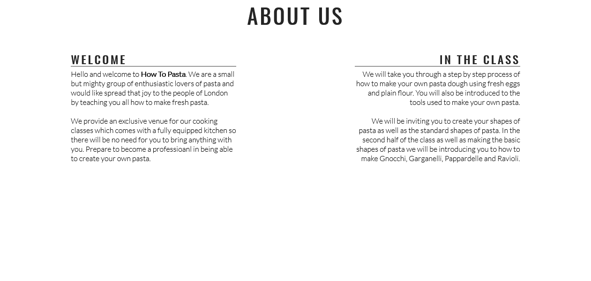</h2>

- ## The Why Learn To Make Pasta section
    
    - At the top you have the section heading.

    - In the middle of the section the is a background image of fresh pasta for aesthetics.

    - In section of the page it provides the user with four benefits of making fresh pasta instead of store bought pasta.

<h2>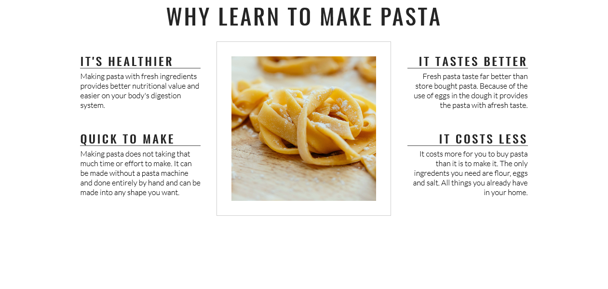<h2>

- ### Days and times

    - This section of the page provides the user with a table of the avaliable days and times they are able to take the class.

    - The price is also provided.

    - The table is also a link that will take the user to the Sign Up page where they can register for classes.

<h2>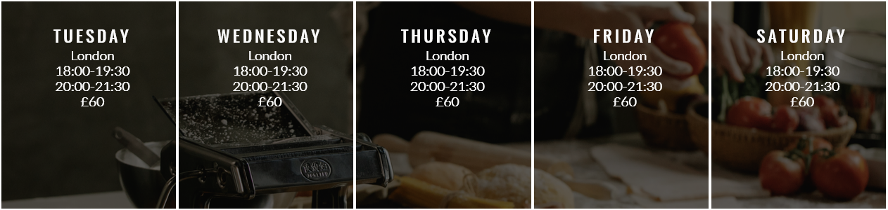<h2>

- #### Contact Section
    
    - The contact section also includes social media icons that link to facebook, twitter,
    Youtube and Instagram which the users can follow.

    - The Contact Section encourages users to get contact by providing a phone number, email address and street address. 

<h2><h2>

<h2><h2>

- #### Gallery page

    - The gallery page is a collection of images used to show the user what they can and could be making in the class.

<h2>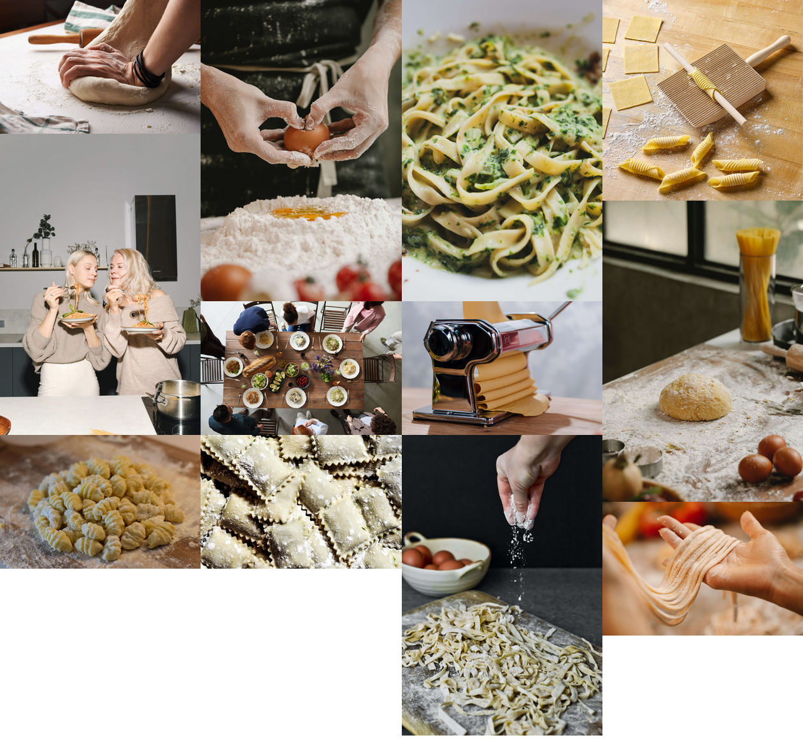<h2>

- #### Sign Up page

    - The Sign Up page has a background image for aesthetics.

    - placed in front of the image is the form box where the user can imput there first name, last name, email address, day and time they want to take the class.

    - When the user places there cursor over the imput box it turns red.

    - The day and time options for the user is presented as a dropdown menu.

<h2>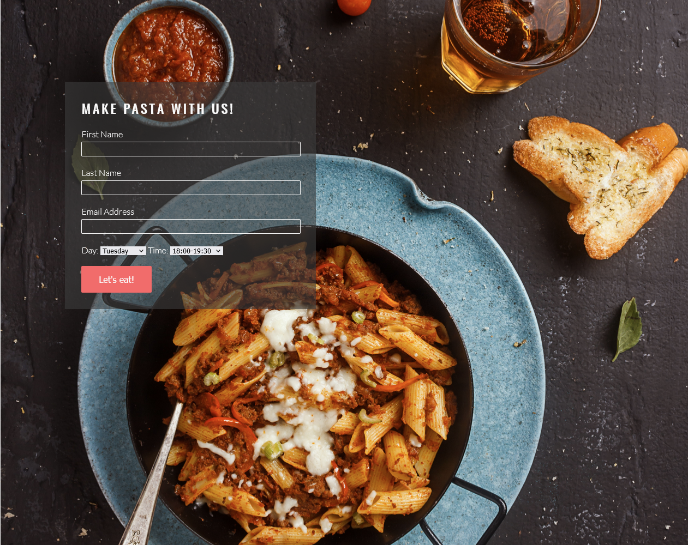<h2>
<h2>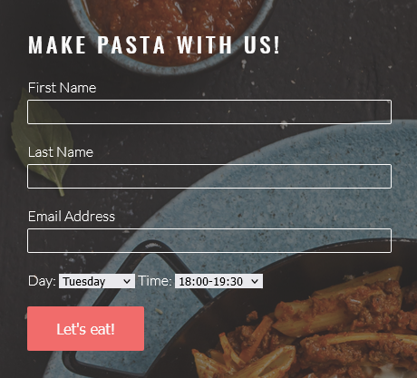<h2>

 # Testing

- I confimed that the pages of the website work using different browsers: Chrome, Firefox, Safari.

- I confirmed the website is responsive and funtions on all standard screen sizes using the devtools toolbar.

- I have confirmed that the navigational links on all pages are working.

- I have confirmed that the form is working: requires entries in all fields with emails only in the email field.

- I have confirmed that the submit button works.

## Validator Test

- HTML

- No errors were found when all HTML pages passed through the official W3C validator.

- CSS

- No errors were found when CSS style sheet passed through the official Jigsaw validator.

 ## Lighthouse Test

- I confirmed that all pages of the website are accessible by the Lighthouse devtool.

<h2>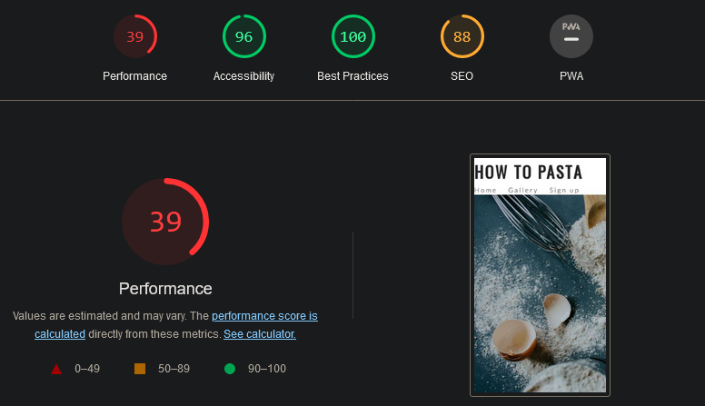<h2>
<h2>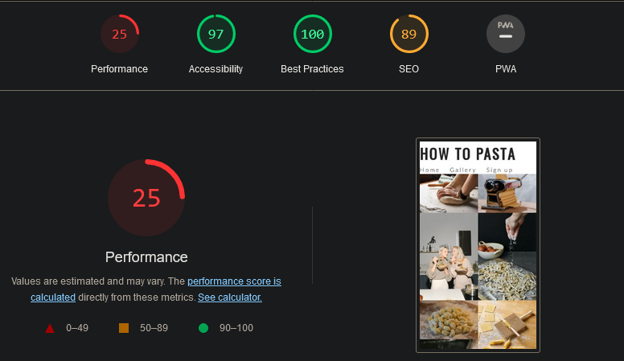<h2>
<h2>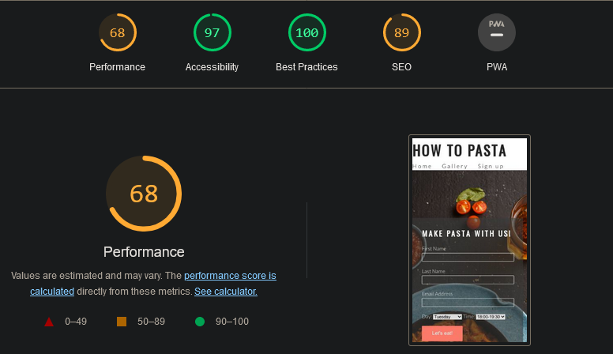<h2>

- ### Bugs

    solved bugs

    - When the website was deployed to GitHub Pages the images for gallery pages and the background image for the sign up page failed to load.

    - I had missed a full stop (.) when typing the file paths.

    - I fixed the problem.

- ### Unfixed Bugs

    - No unfixed bugs.

# Deployment

- ## The website was deployed to GitHub pages. These are the steps...

    - In my GitHub repository, go to the Settings tab.

    - From the Settings tab navigate down the page to the GitHub Pages tab.

    - From the source section drop-down menu, select Main Branch and cilck Save.
    
    - Once that is done a link to the website will be provided.

The link can be found here: [How To Pasta](https://themanintheback.github.io/project1/index.html)

# credit

 ## content

- The code for the social media links, table of days and times was taken from the CI [Love Running](https://github.com/Code-Institute-Solutions/love-running-2.0-sourcecode) project.

## Media

- All images on the webstie were taken from pexels.